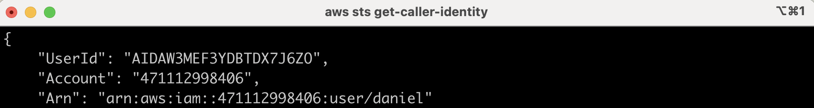
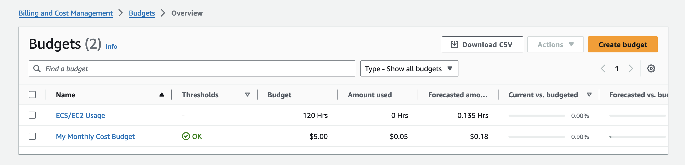
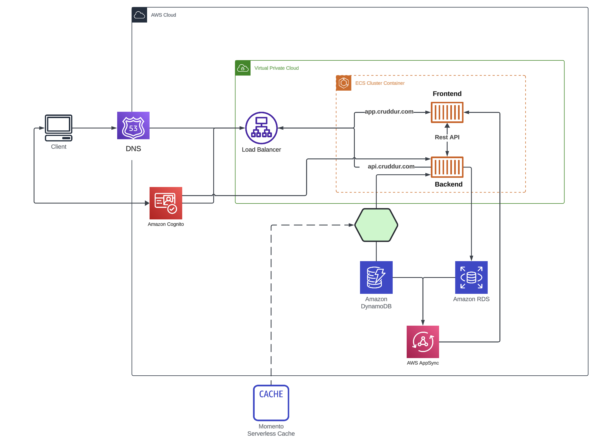

# Week 0 — Billing and Architecture

## Required Homework

### Install and verify AWS CLI

I installed the AWS CLI on Gitpod via iTerm. I followed the instructions for the Linux installation from the [AWS CLI Install Documentation Page](https://docs.aws.amazon.com/cli/latest/userguide/getting-started-install.html).

Here's the installation command:
```
curl "https://awscli.amazonaws.com/awscli-exe-linux-x86_64.zip" -o "awscliv2.zip"
unzip awscliv2.zip
sudo ./aws/install
```

See Gitpod.Yaml file [here](https://github.com/KoolDeep1/aws-bootcamp-cruddur-2023/blob/main/.gitpod.yml). Attaching the code below for convenience:

```
# Gitpod configuration file for setting up the development environment

tasks:
  - name: aws-cli  # Task name for AWS CLI installation
    env:
      AWS_CLI_AUTO_PROMPT: on-partial  # Enables auto-prompt for AWS CLI
    init: |
      # Navigate to the workspace directory
      cd /workspace
      
      # Download the AWS CLI installation package for Linux
      curl "https://awscli.amazonaws.com/awscli-exe-linux-x86_64.zip" -o "awscliv2.zip"
      
      # Unzip the downloaded package
      unzip awscliv2.zip
      
      # Run the installation script
      sudo ./aws/install
      
      # Navigate back to the workspace root
      cd $THEIA_WORKSPACE_ROOT

# List of VS Code extensions to be installed in the development environment
vscode:
  extensions:
    - 42Crunch.vscode-openapi  # Extension for OpenAPI (Swagger) support
```

You can see in the screenshot bellow that the installation was successful



### Create a Budget



### Cruddur Logical Architectural Design



[Lucid Charts Share Link](https://lucid.app/lucidchart/ed86a6d4-bc97-4bff-93fe-c6d57333969a/edit?viewport_loc=-403%2C64%2C2680%2C1678%2C0_0&invitationId=inv_d4aece03-f448-4331-86da-c40538c2d985)
